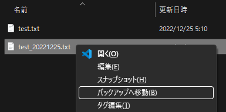

# バックアップ

ファイルをアーカイブフォルダに移動

## 機能

作業フォルダの作業に不要なファイルをアーカイブフォルダに移動します。  

ルールを次のように定義しました:

* ファイルのリストが読みにくくなったと感じたら整理します。

ツールの動作を次のように定義しました:

* ファイルをアーカイブフォルダに移動します。
* アーカイブフォルダは、作業フォルダのサブフォルダとします。
* アーカイブフォルダの名前は、「_old」に固定します。

## 使い方

エクスプローラでファイルを選択し、コンテキストメニュー(`コンテキストメニュー`キー、または `SHIFT＋F10`)を開きます。
コンテキストメニューから「`バックアップへ移動(B)`」を選択します。

アーカイブフォルダにファイルが移動します。  
移動元からファイルが消え、アーカイブフォルダ「_old」が作成します。  
移動先にファイルが移動し、管理用ファイル(_backup.sum)が追加します。

移動元：

移動先(_old フォルダ)：

補足メモ

管理用ファイル(_backup.sum)は、移動したファイルの MD5 ハッシュ計算したダイジェストファイルです。バックアップ時に計算結果を追記します。

