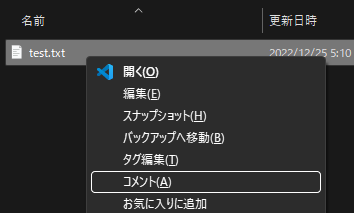
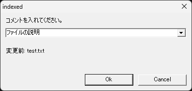
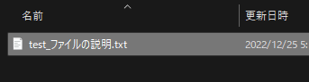

# コメント

ファイルの説明をコメント追加

## 機能

ファイル名の末尾にファイルの説明をコメント追加します。

ルールを次のように定義しました:

* コメントはファイル名の末尾に追記します。
* コメントはファイル名の一部ですが識別には使わない。

ツールの動作を次のように定義しました:

* 日付の後に追加します。

## 使い方

エクスプローラでファイルを選択し、コンテキストメニュー(`SHIFT＋コンテキストメニューキー`、または `SHIFT＋F10`)を開きます。
コンテキストメニューから「`コメント(A)`」を選択します。

コメント設定ダイアログが表示され、コメントを入力し「OK」します。

ファイル名の末尾にコメントが追加されます。

