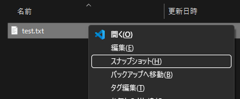
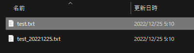

# スナップショット

編集中ドキュメントのスナップショット作成

## 機能

最終編集日に基づいたコードを名前の末尾に付けたファイル(スナップショット)に複製します。

ルールを次のように定義しました:

* 編集するファイルは、ファイル名に日付情報のついていないファイルのみにします。  
　編集可能なファイルの例) test.txt  
　編集しないファイルの例) test_20221225.txt

ツールの動作を次のように定義しました:

* スナップショットは、ファイル名に時系列コードを与えます。
* 時系列のコードは、年、月、日、編集日内の記録順文字(なし,a,b,c,...)で構成します。  
  (例:20210901、20210901a)
* 時系列のコードを与えたドキュメントファイルは、読み込み専用にします。

## 使い方

    注:編集中のドキュメントは、こまめに保存して下さい。
    (アプリのクラッシュや電源OFFなどにより編集した内容がなくならないように)

エクスプローラでファイルを選択し、コンテキストメニュー(`コンテキストメニュー`キー、または `SHIFT＋F10`)を開きます。
コンテキストメニューから「`スナップショット(H)`」を選択します。

時系列のコードのついたファイルが複製されます。

