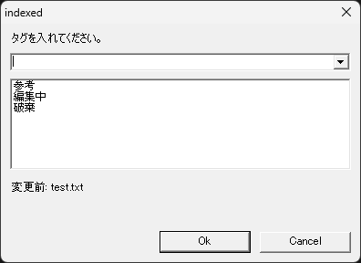

# タグ

ファイルの作業状態を表示

## 機能

ファイル名の先頭に作業状態を設定します。

ルールを次のように定義しました:

* ファイル名の先頭に状態を明記します。
* 状態は一つのみとします。

ツールの動作を次のように定義しました:

* 状態は括弧で囲みます。

## 使い方

エクスプローラでファイルを選択し、コンテキストメニュー(`コンテキストメニュー`キー、または `SHIFT＋F10`)を開きます。
コンテキストメニューから「`タグ編集(T)`」を選択します。

タグ設定ダイアログが表示され、タグを入力し「OK」します。
タグを空にするとタグを削除します。  
タグの候補は以下がありますが、状態や分類を識別しやすい単語を使用します。

|タグ|説明|
|----|----|
|参考|他から持ってきた参考資料を作業フォルダに置き、タグ付けして編集対象でないことを明示|
|発行|編集後、発行したものであること明示|
|編集中|共有しているファイルの場合などにおいて、編集中であることを周知したい時に明示|
|(空)|タグは削除|
|||

ファイル名の先頭にタグが追加されます。

